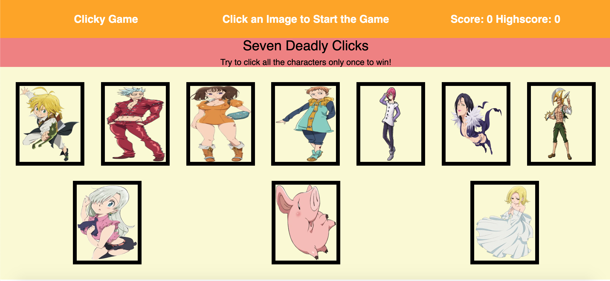

# Clicky Game

A React App where you play a clicky game trying to click each unique character only once. If you click a character that hasn't been clicked yet a message will appear at the top saying coorect otherwise if they have been clicked it will say incorrect. If you manage to click all 10 characters only once YOU WIN!!! What makes this hard is everytime you click on a character they randomly shuffle the character cards on the page. GOOD LUCK!!!

# Link to Deployed Site
[Clicky Game](https://jerry-dudum.github.io/Clicky-Game/)

# Built With
- HTML
- CSS
- Javascript
- JSX
- React
